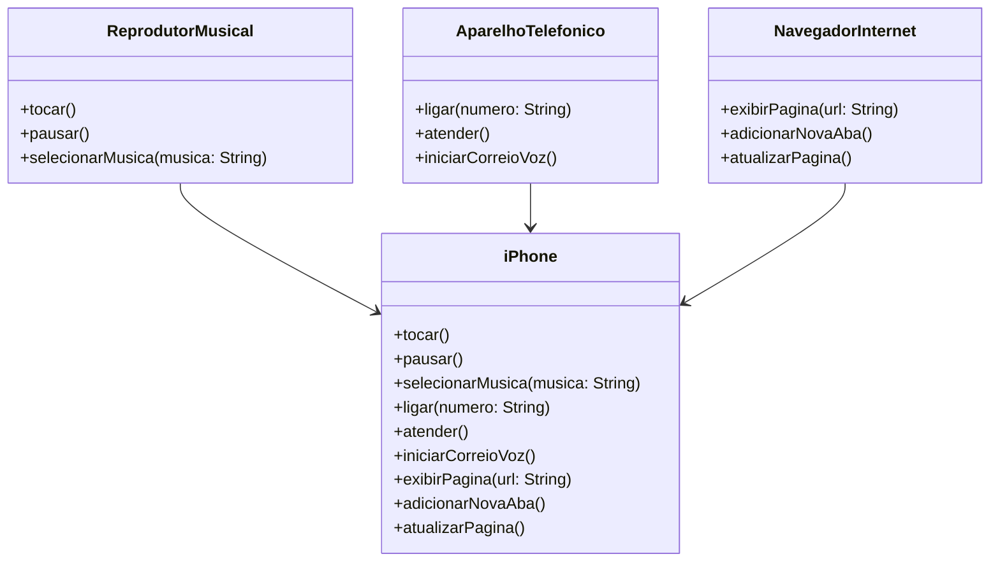

```mermaid
classDiagram
direction TB
    class iPhone {
	    +tocar()
	    +pausar()
	    +selecionarMusica(musica: String)
	    +ligar(numero: String)
	    +atender()
	    +iniciarCorreioVoz()
	    +exibirPagina(url: String)
	    +adicionarNovaAba()
	    +atualizarPagina()
    }

    class ReprodutorMusical {
	    +tocar()
	    +pausar()
	    +selecionarMusica(musica: String)
    }

    class AparelhoTelefonico {
	    +ligar(numero: String)
	    +atender()
	    +iniciarCorreioVoz()
    }

    class NavegadorInternet {
	    +exibirPagina(url: String)
	    +adicionarNovaAba()
	    +atualizarPagina()
    }

    ReprodutorMusical --> iPhone
    AparelhoTelefonico --> iPhone
    NavegadorInternet --> iPhone

```